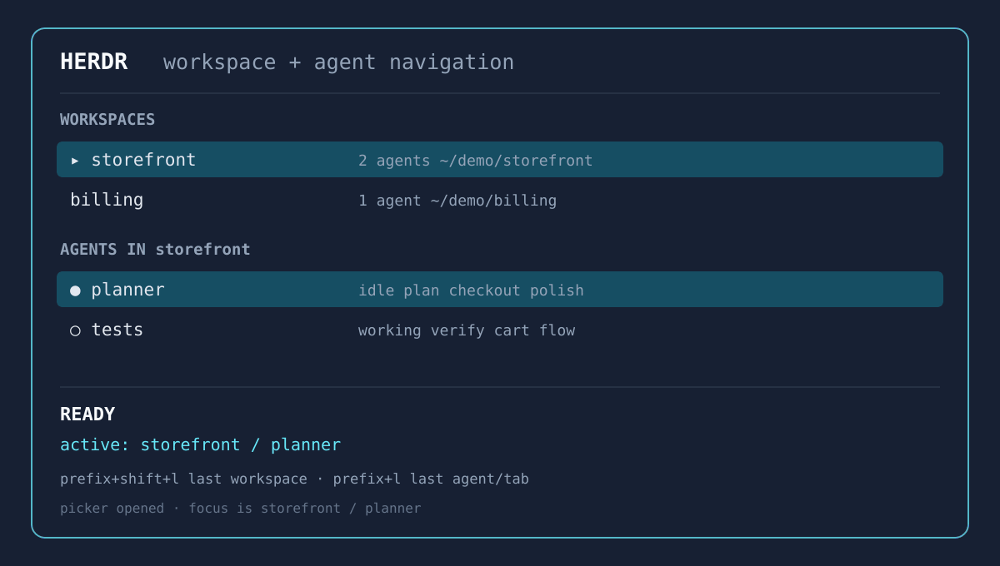
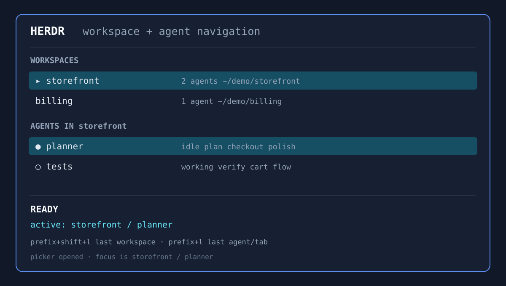
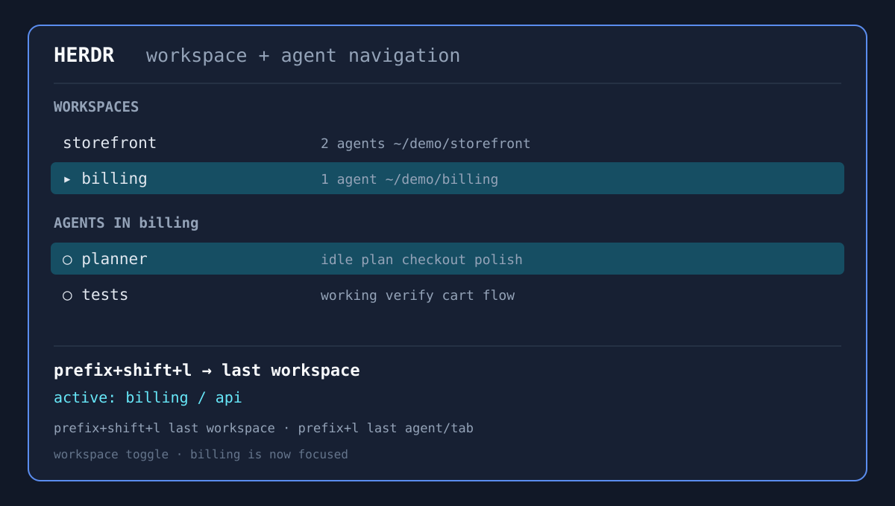
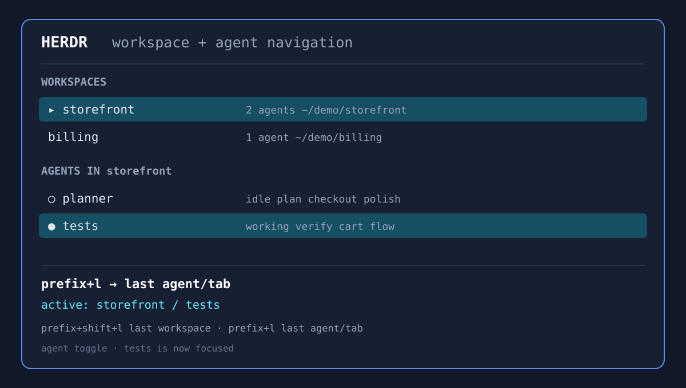

# Sesh for Herdr

[](https://github.com/RooseveltAdvisors/herdr-plugin-sesh/releases/latest)
[](go.mod)
[](LICENSE)
[](https://github.com/RooseveltAdvisors/herdr-plugin-sesh/actions/workflows/test.yml)
[](https://github.com/RooseveltAdvisors/herdr-plugin-sesh/actions/workflows/lint.yml)

## Demo

Open the picker, jump between workspaces, then toggle the previous agent/tab —
the active target stays visible in the status line.



| Picker opens on the current workspace | `last` returns to the previous workspace | `last-agent` toggles the previous agent/tab |
| --- | --- | --- |
|  |  |  |
A [Sesh](https://github.com/joshmedeski/sesh)-inspired workspace picker and
session manager for [Herdr](https://herdr.dev/).

This README describes `main`, including unreleased changes. Use the
[documentation version selector](https://RooseveltAdvisors.github.io/herdr-plugin-sesh/)
for the documentation matching your installed release.

`herdr-plugin-sesh` combines running Herdr workspaces, configured sessions, and
zoxide history in one searchable overlay. Selecting an item focuses its
existing workspace or creates a new one with the configured startup command and
tabs.


See [VISION.md](VISION.md) for why this fork exists and the commitments it keeps.

## Features

- Search active Herdr workspaces, Sesh-style TOML sessions, and zoxide history
  from a native terminal picker, with name matches ahead of path-only matches
  and configurable home-directory priority.
- Match the native picker to Herdr's active theme by default, with a
  configuration toggle to retain the picker's built-in colors.
- Group linked Git worktree workspaces beneath their open parent workspace,
  replace the Herdr sheep icon with a configurable purple `↳ herdr` type, and
  draw tree branches in the native picker.
- Focus an existing workspace or create one from a configured session or
  directory.
- Close active Herdr workspaces directly from the native picker.
- Apply startup commands, previews, and named Herdr tabs to new workspaces.
- Toggle between command previews and live active-pane previews with `Ctrl+O`,
  and drag the divider to resize side-by-side previews.
- Filter, deduplicate, and optionally cache session results, with native
  [workspace, recent, and agent-priority sorting](docs/config.md#picker).
- Toggle between the current and previously focused workspace (`last`) or
  agent/tab (`last-agent`) as strict two-target switches, including focus
  changes made outside the plugin, with separate state for each Herdr session.
- Clone a Git repository and connect to it in one command.
- Use the built-in picker by default or opt into the experimental fzf picker.

Sesh concepts map onto Herdr as follows:

| Sesh | Herdr |
| --- | --- |
| Session | Workspace |
| Window | Tab |
| Picker | Overlay pane |

## Requirements

- [Herdr](https://herdr.dev/docs/installation/) 0.8.2 or newer
- Linux or macOS
- Git and Go 1.26.4 or newer for Herdr's source-based plugin installation
- Optional: `zoxide` for directory history and `eza` for the default preview
- Optional: `fzf` and `bat` for the experimental fzf picker

## Installation

Install the plugin directly from GitHub:

```bash
herdr plugin install RooseveltAdvisors/herdr-plugin-sesh
```

Herdr previews the plugin manifest and build command before installation. To
skip the confirmation in a non-interactive environment, add `--yes`. To pin a
release, add `--ref <release-tag>` using a tag from the
[GitHub releases](https://github.com/RooseveltAdvisors/herdr-plugin-sesh/releases) page.

This repository is also discoverable through the
[Herdr plugin marketplace](https://herdr.dev/plugins/) via the `herdr-plugin`
GitHub topic. Marketplace listings are automatic and are not endorsements or
security reviews.

## Quick start

Open the picker through the installed plugin action:

```bash
herdr plugin action invoke RooseveltAdvisors.herdr-sesh.open-picker
```

You can also open its overlay pane directly:

```bash
herdr plugin pane open \
  --plugin RooseveltAdvisors.herdr-sesh \
  --entrypoint picker \
  --placement overlay
```

See [Keybindings](docs/keybindings.md) to bind the picker, previous-workspace
(`last`), and previous-agent/tab (`last-agent`) two-target toggles.

## Configuration

Configuration is optional. Without a config file, the picker still includes
running Herdr workspaces and zoxide results when zoxide is available.

The plugin reads its versioned native TOML config from the first available
location:

1. `--config PATH`
2. `HERDR_SESH_CONFIG`
3. `${HERDR_PLUGIN_CONFIG_DIR}/config.toml`
4. `${HERDR_PLUGIN_CONFIG_DIR}/sesh.toml` as a legacy fallback
5. `~/.config/herdr-sesh/config.toml`
6. `~/.config/herdr-sesh/sesh.toml` as a legacy fallback
7. `~/.config/sesh/sesh.toml` as a legacy fallback

Legacy Sesh-compatible files still load during the migration period and print a
deprecation warning on stderr. Explicit paths may hold either schema; a
top-level `version` key selects native decoding.

Ask Herdr for the managed configuration directory:

```bash
herdr plugin config-dir RooseveltAdvisors.herdr-sesh
```

See the [configuration reference](docs/config.md) for supported settings and a
complete example.

## CLI

The plugin binary also exposes its underlying operations directly:

| Command | Purpose |
| --- | --- |
| `herdr-sesh picker` | Open the native workspace picker. |
| `herdr-sesh picker --fzf` | Open the experimental fzf picker. |
| `herdr-sesh list --json` | List merged session sources as JSON. |
| `herdr-sesh connect TARGET` | Focus or create a workspace for a name, path, or ID. |
| `herdr-sesh preview TARGET` | Render the configured preview for a session. |
| `herdr-sesh clone REPOSITORY` | Clone a repository and connect to its workspace. |
| `herdr-sesh root --connect` | Connect to the current Git repository root. |
| `herdr-sesh last` | Toggle the previous workspace (strict two-target). |
| `herdr-sesh last-agent` | Toggle the previous agent/tab (strict two-target). |
| `herdr-sesh window [PATH]` | List tabs or create one for a path. |
| `herdr-sesh config path` | Print the resolved plugin config path. |
| `herdr-sesh config init` | Create a starter config if one does not exist. |
| `herdr-sesh config validate [PATH]` | Validate the active or specified config and print its resolved path. |
| `herdr-sesh config migrate` | Convert a legacy Sesh-style config to the native format. |

The binary lives inside Herdr's managed plugin checkout after installation; the
plugin actions are the normal entry points for day-to-day use.

## Local development

See the [contributor guide](docs/development/index.md) for setup, the code map,
verification, and the documentation workflow.

Tool versions are pinned in [`mise.toml`](mise.toml), and common tasks live in
the [`justfile`](justfile).

```bash
mise install
just check
just install-plugin
```

`just install-plugin` builds the binary and links the current checkout into
Herdr. Local builds (`just build` and `just install-plugin`) embed a Git-derived
version, for example `v0.10.1-5-g0686c01`: the nearest reachable version tag,
commits since that tag, and the commit hash. Uncommitted tracked changes append
`-dirty`; an exact clean tag uses the tag alone. Without a reachable version tag,
the commit hash is used; without Git metadata, the version falls back to `dev`.
Release builds continue to use the release version.

Verify the local plugin with:

```bash
herdr plugin action list --plugin RooseveltAdvisors.herdr-sesh
herdr plugin log list --plugin RooseveltAdvisors.herdr-sesh
```

## Release

Release tags must begin with `v` and match `version` in
[`herdr-plugin.toml`](herdr-plugin.toml). Create and publish a release with:

```bash
just release vX.Y.Z
```

The recipe must run from `main` with a clean working tree. It validates the tag
against the manifest version, runs the repository checks and CLI smoke tests,
generates `CHANGELOG.md`, tags the release source commit, commits the changelog
as a follow-up, and atomically pushes `main` and the tag.

## License

Licensed under the [MIT License](LICENSE).
